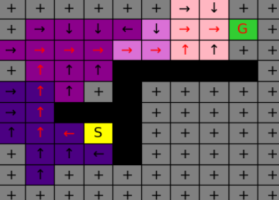

# K-Means, GMM, and Reinforcement Learning
- Reinforcement Learning: Implemented Qlearning algorithms withboth epsilon-greedy and softmax policy in a
stochastic maze environment.
- Unsupervised Learning-Clustering: Experimented and evaluated both k-Means and EM algorithm with Gaussian mixtures on different data clusters.

  
  
 

 

 
 
  

## Implementations include:
* `maze.py` defines the MazeEnv class, the simulation environment which the Q-learning agent will interact in.
* `qlearning.py` defines the implemented `qlearn` function, along with several helper functions.
* `plotting_utils.py`: defines several plotting and visualization utilities.
* **`K-Means-GMM-and-Reinforcement-Learning.ipynb`** the final jupyter notebook project.
